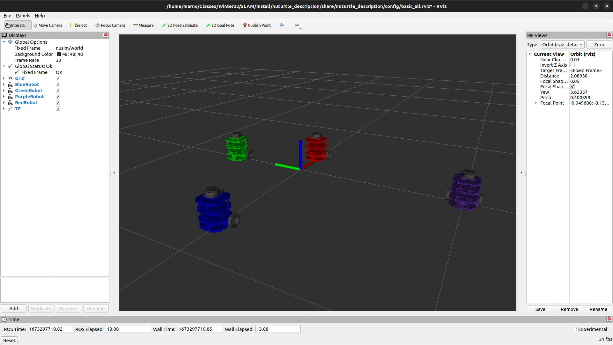

# Nuturtle  Description
URDF files for Nuturtle <Name Your Robot>
* `ros2 launch nuturtle_description load_one.launch.py color:=<color>` to see the `<color>` robot in rviz.
* `ros2 launch nuturtle_description load_all.launch.xml` to see four copies of the robot in rviz.

* The rqt_graph when all four robots are visualized (Nodes Only, Hide Debug) is:

# Launch File Details
* `ros2 launch nuturtle_description load_one.launch.py --show-args`

        Arguments (pass arguments as '<name>:=<value>'):

            'use_jsp':
                Choose if joint_state_publisher needs to be launched. Valid choices are: ['true', 'false']
                (default: 'true')

            'use_rviz':
                Choose if RVIZ needs to be launched. Valid choices are: ['true', 'false']
                (default: 'true')

            'color':
                Sets color of the turtlebot3 in the urdf. Valid choices are: ['red', 'green', 'blue', 'purple', '']
                (default: 'purple')
    
* `ros2 launch nuturtle_description load_all.launch.xml --show-args`

        Arguments (pass arguments as '<name>:=<value>'):

            'use_jsp':
                Choose if joint_state_publisher needs to be launched. Valid choices are: ['true', 'false']
                (default: 'true')

            'use_rviz':
                Choose if RVIZ needs to be launched. Valid choices are: ['true', 'false']
                (default: 'true')

            'color':
                Sets color of the turtlebot3 in the urdf. Valid choices are: ['red', 'green', 'blue', 'purple', '']
                (default: 'purple')
                
Worked with:
* James
* Nick
* Megan
* Dilan
* Liz
